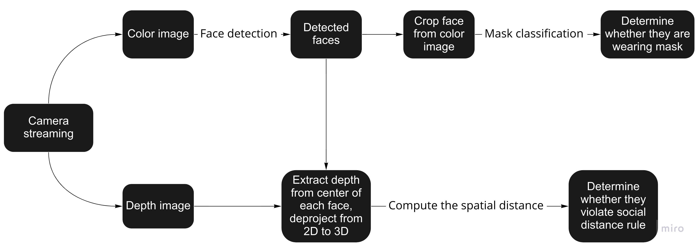
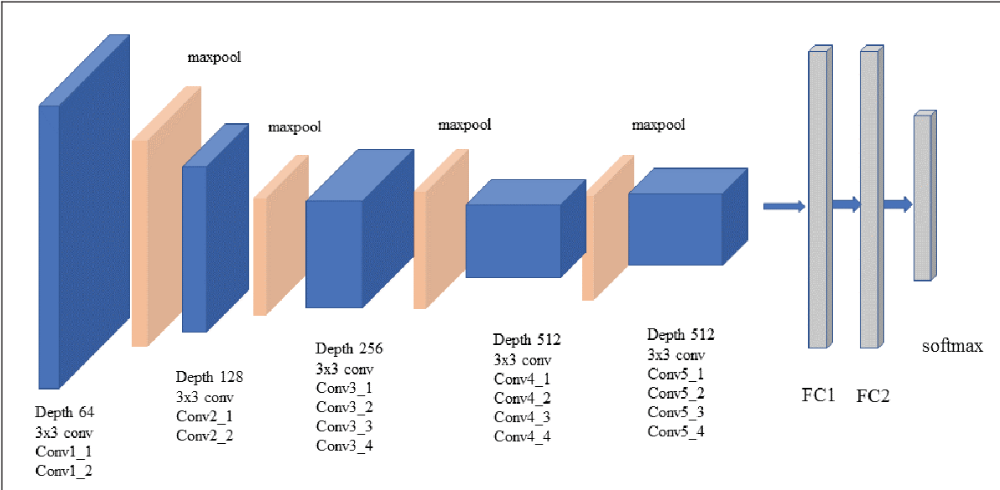
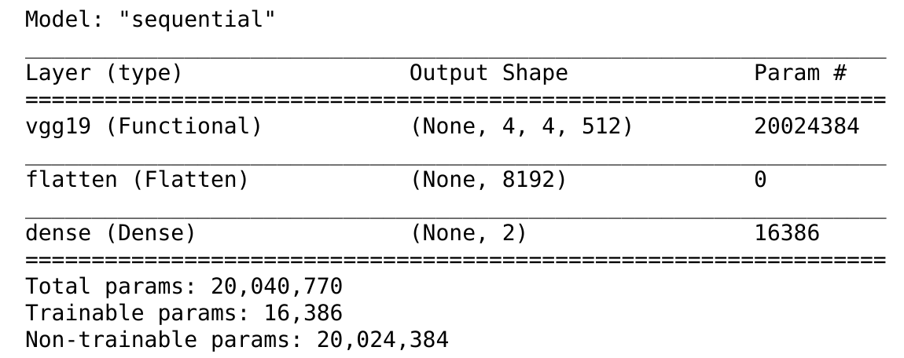

# WinterProject2022 - Covid_Terminator

### Introduction:

Since the COVID outbreak, in 2020, people around world are suffer from its high dissemination and lethality. However, this epidemic could be effectively mitigated or even ended if every one are wearing masks and keeping a safe social distance. Therefore, this project is to help detect and warning people to wear mask and keep social distance from other other using deeping learning and depth camera.

There are two general tasks this project reaches:

1. Detect each face (using Haar Cascade) and classify whether it wears a mask (using VGG19 )
2. Determine whether each person violate the social distance rule (using RealSense Camera D435)

### Dependences: 

Numpy : linear algebra operation

Scipy: for spatial distance computation

Keras:  high-level neural network library for deep learning tasks

cv2: provides a real-time optimized computer vision library

pyrealsense2: software API for realsense camera

### Quickstart Guide:

1. Install all dependences in your local environment.
2. Clone this repository.
3. Make sure to put “Face Mask Dataset” into the same directory with your COVID_Terminator.ipynb for convenient.
4. Connect the realsense camera to your computer successfully.
5. Download the COVID_Terminator.ipynb and run it cell by cell, each step is commented in this file as well.

### Dataset:

Face Mask Dataset ~12K Images Dataset:

This dataset is used for Face Mask Detection Classification with images. The dataset consists of almost 12K images which are almost 328.92MB in size, contains three subfiles: Test, Train and Validation

Source: https://www.kaggle.com/datasets/ashishjangra27/face-mask-12k-images-dataset

### Pipeline:

### Face Detection:

In this project, I used Haar Cascades Feature-based Cascade Classifier for human face detection in real time. It is a machine learning based approach in which a cascade function is trained from a lot of positive and negative images. Initially, the algorithm needs a lot of positive images (images of faces) and negative images (images without faces) to train the classifier. Then we need to extract features from it. They are like our convolutional kernel. Each feature is a single value obtained by subtracting the sum of pixels under the white rectangle from the sum of pixels under the black rectangle.

For more detail: https://docs.opencv.org/3.4/d2/d99/tutorial_js_face_detection.html

### Mask Classifier:

In this project, VGG19 model is used as backbone for feature extraction. VGG19 is a very deep Convolutional Neural Network (CNN) for large-scale image recognition. The default architecture is shown following: 

The backbone layers I adapted from VGG19 include two Conv3x3 (64) , two Conv3x3(128), four Conv3x3(256), eight Conv3x3(512) and four MaxPooling. Then, I add one flatten layer and one sigmoid dense layer to build the classification model shown below:

### Future Improvement:

Although this project can function well detecting few people in real time, it might occur delay to track the faces when the number of people is significantly increasing. Since the current approach is using two stage detection, some one stage algorithm could be implement to speed up the detection and classification processing, like YOLO.

### Demo:

https://youtu.be/gskzlC876W8

In this demo, text color show mask wearing(green) or no mask(red), and box color show social distance violation(red) or not(green).

 